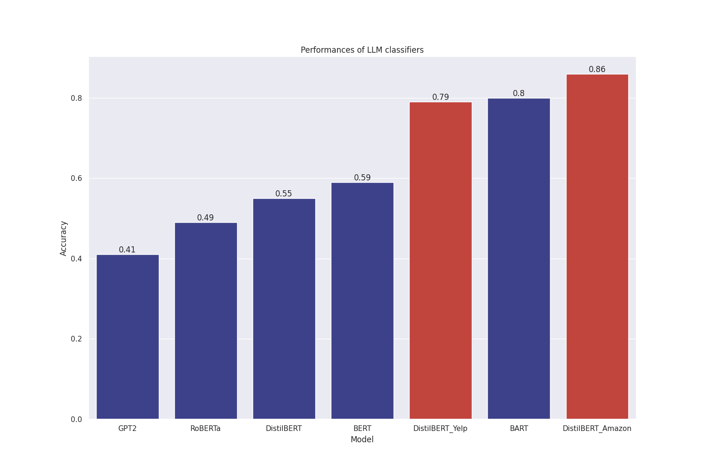
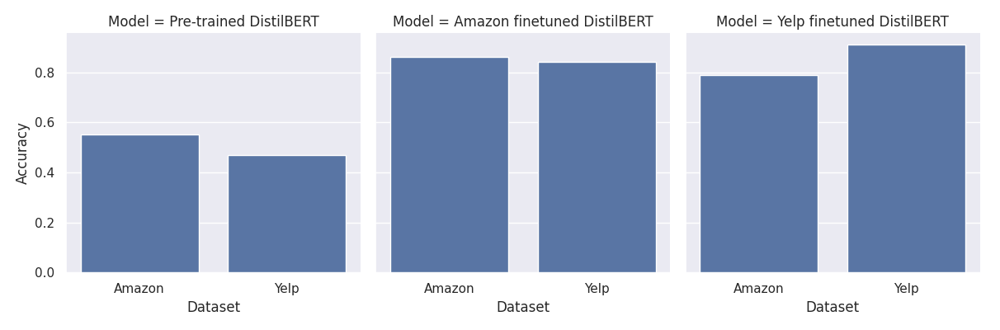
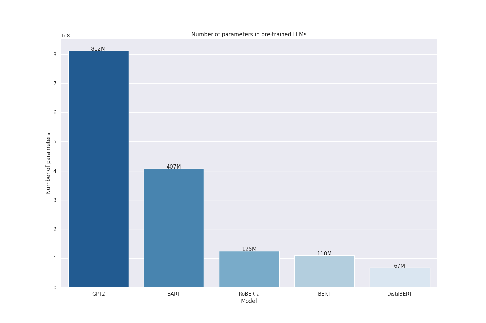

# Online Product Review Sentiment Analysis

This repository contains the implementation and analysis of sentiment analysis on e-commerce product reviews using various Natural Language Processing (NLP) techniques, focusing on both traditional machine learning models like Long Short-Term Memory (LSTM) networks and Convolutional Neural Networks (CNNs), as well as modern Large Language Models (LLMs) including GPT-2, BERT, BART, RoBERTa, and DistilBERT.

## Table of Contents
- [Introduction](#introduction)
- [Datasets](#datasets)
  - [Amazon Dataset](#amazon-dataset)
  - [Yelp Dataset](#yelp-dataset)
- [Methodology](#methodology)
  - [Preprocessing](#preprocessing)
  - [Feature Extraction](#feature-extraction)
  - [Model Architectures](#model-architectures)
- [Results](#results)
  - [DNN Performance](#dnn-performance)
  - [LLM Performance](#llm-performance)
- [Discussion](#discussion)
- [Conclusion](#conclusion)
- [Future Work](#future-work)
- [How to Run the Code](#how-to-run-the-code)

## Introduction

This project focuses on binary classification of e-commerce product reviews into positive or negative sentiments. The study compares the effectiveness of traditional DNNs against advanced LLMs in capturing sentiment from text data. The goal is to guide practitioners in selecting appropriate NLP techniques for sentiment analysis tasks in e-commerce.

## Datasets

### Amazon Dataset
- **Source**: Figshare
- **Content**: Review titles, subjects, and ratings (1 to 5) across various product categories.
- **Labels**: Converted to binary labels (positive for ratings > 3, negative for ratings < 3).
- **Size**: 3,000,000 training entries, 650,000 test entries.

### Yelp Dataset
- **Source**: Kaggle
- **Content**: Review titles and class indices (1 for negative, 2 for positive).
- **Size**: 560,000 training entries, 38,000 test entries.

## Methodology

### Preprocessing
The following preprocessing steps were applied uniformly across the datasets:
- **Special Character and Noise Removal**: Removed punctuation and symbols.
- **Lowercasing**: Converted text to lowercase for consistency.
- **Stopword Removal**: Eliminated common stopwords.
- **Tokenization**: Split text into individual words.
- **Binary Classification**: Converted ratings into binary labels at runtime.

### Feature Extraction
- **Bag-of-Words (BoW)**: Encoded the presence/absence of words as binary values.
- **TF-IDF**: Weighted words based on their frequency in a document relative to the corpus.
- **GloVe Embeddings**: Generated dense vector representations capturing semantic relationships.
- **N-grams**: Extracted unigrams and bigrams for capturing contextual information.

### Model Architectures

#### Deep Neural Networks (DNNs)
- **LSTM**: Captures temporal dependencies in sequential data.
- **CNN**: Processes and understands sequential data in one dimension.

#### Large Language Models (LLMs)
- **GPT-2**: A transformer model capturing contextual nuances in text.
- **BERT**: Bi-directional transformer model for deep understanding of context.
- **BART**: Combines bidirectional and autoregressive transformers.
- **RoBERTa**: An optimized version of BERT with improved pre-training.
- **DistilBERT**: A lightweight version of BERT, retaining most of its performance.

## Results

### DNN Performance
- **LSTM**: Training accuracy of 67%, test accuracy of 61%.
- **CNN**: Training accuracy of 73%, test accuracy of 61%.

### Zero-shot LLM Performance
- **GPT-2**: Accuracy of 42% on Amazon, 49.7% on Yelp.
- **BART**: Accuracy of 81.1% on Amazon, 94% on Yelp.
- **BERT**: Accuracy of 59.3% on Amazon, 57.8% on Yelp.
- **RoBERTa**: Accuracy of 49.1% on Amazon, 51% on Yelp.
- **DistilBERT**: Accuracy of 54.4% on Amazon, 48.9% on Yelp.

### Fine-tuned LLM Performance
- **Fine-tuned DistilBERT**: Substantial improvements with accuracies up to 87% for Amazon and 94% in Yelp with significant improvement in the efficiency.
  

## Discussion

The results indicate that LLMs, particularly BART and fine-tuned DistilBERT, outperform traditional DNN models like LSTM and CNN in sentiment analysis tasks. Fine-tuning significantly enhances the performance of LLMs on specific datasets, making them more adaptable to different e-commerce platforms.

## Conclusion

This study demonstrates the superiority of LLMs over traditional DNNs in the sentiment analysis of e-commerce product reviews. The findings suggest that LLMs are better suited for capturing the nuanced context of reviews, especially when fine-tuned on domain-specific datasets.

Accuracies of zero-shot LLM classifiers and fine-tuned DistilBERT on Amazon and Yelp


Accuracies of pre-trained and finetuned DistilBERT on Yelp and Amazon:


Complexity of LLMs used:


## Future Work

- **Multiclass Sentiment Classification**: Expanding the classification to include neutral and mixed sentiments.
- **Model Interpretability**: Enhancing the explainability of LLM decisions.
- **Real-Time Sentiment Analysis**: Developing models for real-time application.
- **Longitudinal Sentiment Analysis**: Tracking sentiment changes over time.
- **Personalized Recommendations**: Integrating sentiment analysis with recommendation systems.

## How to Run the Code

1. Clone the repository:
   ```bash
   git clone https://github.com/yourusername/online-product-review-sentiment-analysis.git
   ```
2. Install the required dependencies
   ```bash
   pip install -r requirements.txt
   ```
3. Install Jupyter notebook (using Anaconda) and run the notebooks
   ```bash
   jupyter notebook conclusion.ipynb
   ```
